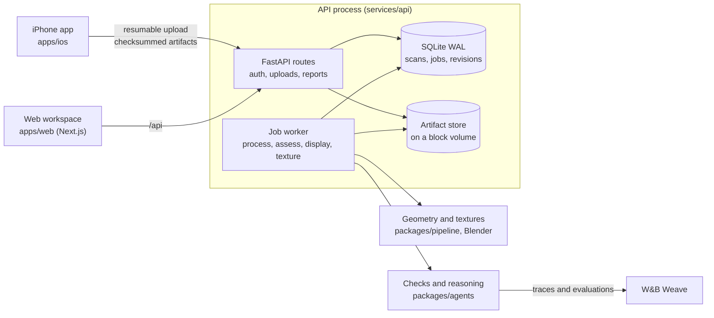

# Standard Physics

[](https://github.com/Imhaohao/standardphysics/actions/workflows/ci.yml)
[](https://github.com/Imhaohao/standardphysics/actions/workflows/web.yml)
[](https://github.com/Imhaohao/standardphysics/actions/workflows/ios.yml)

A shop owner walks their store with an iPhone. Standard Physics turns the LiDAR scan into a measured 3D model, checks every aisle, doorway and counter against the ADA standards, and shows each problem on the model with the measurement and the rule it breaks. When the fix is moving furniture, it proposes a layout that works with what the shop already owns.

| | |
|---|---|
| Live app | [standardphysics.app](https://standardphysics.app), with the iPhone app on TestFlight |
| W&B Weave traces | [imhaohao-university-of-california-berkeley/physics](https://wandb.ai/imhaohao-university-of-california-berkeley/physics/weave) |
| Production | One DigitalOcean droplet (2 vCPU, 4 GB) running the compose stack in [`deploy/digitalocean`](deploy/digitalocean) |

## How it's built



An upload lands in the artifact store and queues a `process` job. The worker turns the RoomPlan export and the LiDAR mesh into a scene graph, `assess` runs the ADA checks over it, `display` renders the picture beside each finding, and `texture` paints the scan from the photos. The scene graph is versioned: an owner's edit, a rebuild or a re-run of discovery saves a new revision on top of the one it started from, so nothing overwrites what came before.

| Path | What it is | Tests |
|---|---|---|
| [`packages/contracts`](packages/contracts) | Pydantic models every other part shares, and the TypeScript generated from them | 14 |
| [`packages/pipeline`](packages/pipeline) | Scan ingest, measurement, object discovery, texture baking | 281 |
| [`packages/agents`](packages/agents) | The ADA checks, the layout fixer, the evaluation suite, Weave tracing | 161 |
| [`services/api`](services/api) | FastAPI service: accounts, uploads, the job queue and worker | 318 |
| [`apps/web`](apps/web) | Next.js workspace and the owner's report | 45 files |
| [`apps/ios`](apps/ios) | SwiftUI capture app with resumable uploads | 117 |
| [`deploy/digitalocean`](deploy/digitalocean) | Production compose stack: Caddy, API, web | |
| [`tests`](tests), [`scripts/tests`](scripts/tests) | Cross-package regressions and tooling tests | 284 |

Dependencies point one way: `contracts` at the bottom, `pipeline` and `agents` above it, `services/api` above those, and the two apps talk to the API over HTTP only.

## Running it

You need Python 3.11+ and Node 20.9+.

```bash
./start.sh                          # installs into .venv and apps/web, runs the API on :8787 and the web on :3000
SP_SEED_SAMPLE_SHOP=1 ./start.sh    # same, with a sample shop and a demo account printed to the log
docker compose up --build           # the production image, API and web as two containers
```

The checks CI runs:

```bash
.venv/bin/python -m ruff check .
.venv/bin/python -m pytest
cd apps/web && npm run lint && npm run typecheck && npm run test
```

## Production readiness

**Jobs survive crashes.** The queue lives in SQLite with WAL and `BEGIN IMMEDIATE` transactions, and a job is claimed atomically ([`repository.py`](services/api/standardphysics_api/repository.py)). At startup every job left running is queued again. An exclusive lock beside the database keeps a second process from running the same jobs ([`worker_lock.py`](services/api/standardphysics_api/worker_lock.py)). The worker loops back off and retry when the database errors, and a photo bake that runs past its time limit is killed and its job marked failed ([`worker.py`](services/api/standardphysics_api/worker.py)). The failure-injection tests are in [`test_worker_resilience.py`](services/api/tests/test_worker_resilience.py) and [`test_job_lifecycle.py`](services/api/tests/test_job_lifecycle.py).

**Uploads are resumable and verified.** The phone keeps its upload progress on disk ([`ResumableUploadStore.swift`](apps/ios/StandardPhysics/Upload/ResumableUploadStore.swift)), every artifact carries a SHA-256 the server checks, files are written atomically, and a repeated upload is idempotent ([`store.py`](services/api/standardphysics_api/store.py)).

**Inputs are bounded.** Each scan has a cap on artifact count and total bytes, a `room.usdz` is refused if it expands too far or holds too many entries ([`usdz_validation.py`](services/api/standardphysics_api/usdz_validation.py)), and sign-up, sign-in and guest creation are throttled per network.

**Access is explicit.** Passwords use scrypt and session tokens are stored hashed ([`accounts.py`](services/api/standardphysics_api/accounts.py)). Every scan route checks ownership, and team tools require a granted role that nobody gets by signing up ([`team.py`](services/api/standardphysics_api/team.py)).

**Health means working.** `/health` reads the database and fails if a worker loop has died. `/health/details` reports each loop's heartbeat and the age of the oldest queued job. The compose stacks gate on these healthchecks.

**Every change is checked.** Three workflows run on every push: Python lint and tests across every package, web lint, types, tests and generated-contract drift, and the iOS build and tests on a simulator. Ruff enforces a cyclomatic complexity ceiling in Python, and ESLint does the same in TypeScript.

**The reasoning is traced.** The checks and the model calls behind them are traced to W&B Weave when `WANDB_API_KEY` and `WANDB_PROJECT` are set ([`tracing.py`](packages/agents/standardphysics_agents/tracing.py)), and the held-out evaluation runs as a Weave Evaluation ([`weave_eval.py`](packages/agents/standardphysics_agents/evaluation/weave_eval.py)).

## Known limitations

- The API is one process with one SQLite database by design. Scaling out means moving the queue to Postgres, which the repository layer isolates but nobody has done yet.
- A texture bake takes about ten minutes per walk on the production droplet, so a new scan shows its measured boxes first and its painted scan when the bake finishes.
- Floor that the phone's LiDAR never reached is patched flat and shown in a plain colour, because no photo can be trusted to show it.

## More

- [`docs/CONTRIBUTING.md`](docs/CONTRIBUTING.md): running each part, the phone build, deploying, and the development lanes
- [`docs/DEPLOY.md`](docs/DEPLOY.md): the production runbook
- [`docs/MISSION.md`](docs/MISSION.md) and [`docs/ARCHITECTURE.md`](docs/ARCHITECTURE.md): what the reasoning layer is for and how it is designed
- [`docs/UX.md`](docs/UX.md): the owner's experience, screen by screen
