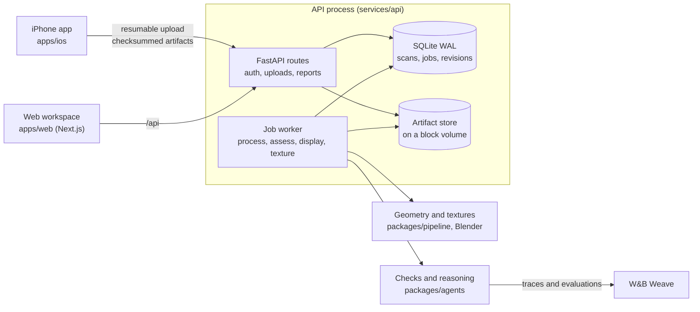

# Standard Physics

[](https://github.com/Imhaohao/standardphysics/actions/workflows/ci.yml)
[](https://github.com/Imhaohao/standardphysics/actions/workflows/web.yml)
[](https://github.com/Imhaohao/standardphysics/actions/workflows/ios.yml)

A shop owner walks their store with an iPhone. Standard Physics turns the LiDAR scan into a measured 3D model, checks every aisle, doorway and counter against the ADA standards, and shows each problem on the model with the measurement and the rule it breaks. When the fix is moving furniture, it proposes a layout that works with what the shop already owns.

| | |
|---|---|
| Live app | [standardphysics.app](https://standardphysics.app), with the iPhone app on TestFlight |
| W&B Weave traces | [imhaohao-university-of-california-berkeley/physics](https://wandb.ai/imhaohao-university-of-california-berkeley/physics/weave) |
| Production | One DigitalOcean droplet (2 vCPU, 4 GB) running the compose stack in [`deploy/digitalocean`](deploy/digitalocean) |

## How it's built



An upload lands in the artifact store and queues a `process` job. The worker turns the RoomPlan export and the LiDAR mesh into a scene graph, `assess` runs the ADA checks over it, `display` renders the picture beside each finding, and `texture` paints the scan from the photos. The scene graph is versioned: an owner's edit, a rebuild or a re-run of discovery saves a new revision on top of the one it started from, so nothing overwrites what came before.

| Path | What it is | Test functions |
|---|---|---|
| [`packages/contracts`](packages/contracts) | Pydantic models every other part shares, and the TypeScript generated from them | 14 |
| [`packages/pipeline`](packages/pipeline) | Scan ingest, measurement, object discovery, texture baking | 281 |
| [`packages/agents`](packages/agents) | The ADA checks, the layout fixer, the evaluation suite, Weave tracing | 155 |
| [`services/api`](services/api) | FastAPI service: accounts, uploads, the job queue and worker | 332 |
| [`apps/web`](apps/web) | Next.js workspace and the owner's report | 45 files |
| [`apps/ios`](apps/ios) | SwiftUI capture app with resumable uploads | 117 |
| [`deploy/digitalocean`](deploy/digitalocean) | Production compose stack: Caddy, API, web | |
| [`tests`](tests), [`scripts`](scripts) | Cross-package regressions, the layering check, deploy and backup scripts | 299 |
| [`tools/loopforge`](tools/loopforge) | The traced agent-loop starter the project began from, kept as a standalone CLI | 2 |

Dependencies point one way: `contracts` at the bottom, `pipeline` and `agents` above it, `services/api` above those, and the two apps talk to the API over HTTP only. [`tests/test_layering.py`](tests/test_layering.py) fails the build if a package imports upward or imports a sibling its `pyproject.toml` does not declare.

## Running it

You need Python 3.11+ and Node 20.9+.

```bash
./start.sh                          # installs into .venv and apps/web, runs the API on :8787 and the web on :3000
SP_SEED_SAMPLE_SHOP=1 ./start.sh    # same, with a sample shop; the log says where the demo account's password is
docker compose up --build           # the production image, API and web as two containers
```

The checks CI runs:

```bash
.venv/bin/python -m ruff check .
.venv/bin/python -m pytest                     # every package, the scripts and the tools
.venv/bin/python -m pytest services/api/tests   # the API, run on its own because its test helpers share names with the agents'
cd apps/web && npm run lint && npm run typecheck && npm run test
```

## Evaluation

The held-out suite is 39 labelled cases: the sample shop as shipped, and variants that move its walls, fixtures and doors so that the right answer changes. `standardphysics-agents weave-eval` scores each configuration of the system against them as a Weave Evaluation, and the [Evals tab](https://wandb.ai/imhaohao-university-of-california-berkeley/physics/weave/evaluations) holds every run with its per-case table. The latest run:

| Configuration | Finding precision | Finding recall | Fix resolves finding | Mean measurement error |
|---|---|---|---|---|
| Measured pipeline, fixes on | 0.986 | 0.924 | 1.000 | 0.0008 in |
| Simplified stand-in measurements | 0.384 | 0.924 | 0.800 | 8.57 in |
| Measured pipeline, fixes off | 0.986 | 0.924 | not scored | 0.0008 in |

The stand-in row is the control. Swapping the measured geometry for merged boxes keeps recall but loses most of the precision, so nearly all of the score comes from measuring the room correctly.

These cases are synthetic variants of one modelled shop, generated so that the correct answer is known exactly. They test that the checks and the fixer reason correctly about geometry. They do not measure accuracy on real scans.

## Production readiness

**Jobs survive crashes.** The queue lives in SQLite with WAL and `BEGIN IMMEDIATE` transactions, and a job is claimed atomically ([`repository.py`](services/api/standardphysics_api/repository.py)). At startup every job left running is queued again, except a simulation, which is marked failed so a restart never spends a second budget of paid model calls; its owner starts a new run. An exclusive lock beside the database keeps a second process from running the same jobs ([`worker_lock.py`](services/api/standardphysics_api/worker_lock.py)). A claimed job always ends settled or back in the queue, whatever fails after the claim. Every kind of job has a deadline, errors that clear on their own are retried a bounded number of times, and a photo bake that runs past its limit is killed ([`worker.py`](services/api/standardphysics_api/worker.py)). The failure-injection tests are in [`test_worker_resilience.py`](services/api/tests/test_worker_resilience.py) and [`test_job_lifecycle.py`](services/api/tests/test_job_lifecycle.py).

**Uploads are resumable and verified.** The phone keeps its upload progress on disk ([`ResumableUploadStore.swift`](apps/ios/StandardPhysics/Upload/ResumableUploadStore.swift)), every artifact carries a SHA-256 the server checks, files are written atomically, and a repeated upload is idempotent ([`store.py`](services/api/standardphysics_api/store.py)).

**Inputs are bounded.** Each scan has a cap on artifact count and total bytes, each account on scans and stored bytes, and the queue on waiting jobs. New uploads are refused with a 507 before the data volume runs out of space, and every upload's size is checked before it is read. A `room.usdz` is opened from disk and refused if it expands too far or holds too many entries ([`usdz_validation.py`](services/api/standardphysics_api/usdz_validation.py)).

**Sign-in is throttled before any password work.** Each server process allows 10 sign-in attempts per email and 30 per client address in five minutes, 10 sign-ups per address an hour and 20 guest accounts per address an hour ([`attempt_limiter.py`](services/api/standardphysics_api/attempt_limiter.py)). An unknown email costs the same single scrypt call as a wrong password, so timing does not reveal which accounts exist.

**Access is explicit.** Passwords use scrypt and session tokens are stored hashed ([`accounts.py`](services/api/standardphysics_api/accounts.py)). Every scan route checks ownership, and team tools require a granted role that nobody gets by signing up ([`team.py`](services/api/standardphysics_api/team.py)).

**Health means working.** `/health` reads the database and fails if a worker loop has died, and stays green through a legitimate long bake. `/health/ready` reports a stalled loop or an overdue job as degraded. `/health/details` adds the deployed commit, each loop's heartbeat, the age of the oldest queued job and whether traces are reaching Weave. The compose stacks gate on these healthchecks, and in the one-container role the workspace waits for the API before it serves anyone.

**Releases can be rolled back and data can be restored.** Every image is tagged with the commit it was built from, so rolling back is a checkout and a restart with no rebuild. [`deploy.sh`](scripts/deploy.sh) refuses to deploy over running jobs. [`backup.sh`](deploy/digitalocean/backup.sh) snapshots the database through SQLite's online backup and the artifacts as incremental rsync snapshots, and [`restore.sh`](deploy/digitalocean/restore.sh) checks a restored copy's integrity. The procedures are in [`docs/DEPLOY.md`](docs/DEPLOY.md). The containers carry memory and CPU limits sized for the 4 GB droplet.

**Every change is checked.** Every push runs ruff, mypy on the contracts and the API service, and every Python suite; the web app's lint, types, tests and a check that the generated TypeScript contracts match the Python ones; a build of the production image followed by a smoke test that signs up and signs in through it; and, for iOS changes, the app's build and tests on a simulator. Python dependencies are pinned in [`requirements.lock`](requirements.lock), which CI, the image and `start.sh` all install. Ruff enforces a cyclomatic complexity ceiling in Python, and ESLint does the same in TypeScript.

**The reasoning is traced.** The checks and the model calls behind them are traced to W&B Weave when `WANDB_API_KEY` and `WANDB_PROJECT` are set ([`tracing.py`](packages/agents/standardphysics_agents/tracing.py)), and the held-out evaluation runs as a Weave Evaluation ([`weave_eval.py`](packages/agents/standardphysics_agents/evaluation/weave_eval.py)).

## Known limitations

- The API is one process with one SQLite database by design. Scaling out means moving the queue to Postgres, which the repository layer isolates but nobody has done yet.
- A texture bake takes about ten minutes per walk on the production droplet, so a new scan shows its measured boxes first and its painted scan when the bake finishes.
- Floor that the phone's LiDAR never reached is patched flat and shown in a plain colour, because no photo can be trusted to show it.

## More

- [`docs/CONTRIBUTING.md`](docs/CONTRIBUTING.md): running each part, the phone build, deploying, and the development lanes
- [`docs/DEPLOY.md`](docs/DEPLOY.md): the production runbook
- [`docs/MISSION.md`](docs/MISSION.md) and [`docs/ARCHITECTURE.md`](docs/ARCHITECTURE.md): what the reasoning layer is for and how it is designed
- [`docs/UX.md`](docs/UX.md): the owner's experience, screen by screen
