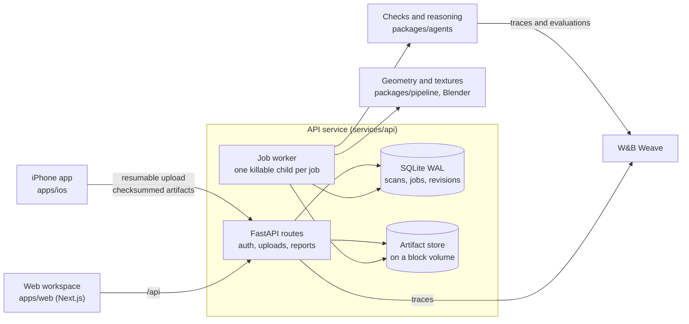

# Standard Physics

[](https://github.com/Imhaohao/standardphysics/actions/workflows/ci.yml)
[](https://github.com/Imhaohao/standardphysics/actions/workflows/ios.yml)

A shop owner walks their store with an iPhone. Standard Physics turns the LiDAR scan into a measured 3D model, checks every aisle, doorway and counter against the ADA standards, and shows each problem on the model with the measurement and the rule it breaks. When the fix is moving furniture, it proposes a layout that works with what the shop already owns.

It runs in production today on real scans, from a boba shop to a whole floor of a university library.

| | |
|---|---|
| Live app | [standardphysics.app](https://standardphysics.app), with the iPhone app on TestFlight |
| W&B Weave traces | [imhaohao-university-of-california-berkeley/physics](https://wandb.ai/imhaohao-university-of-california-berkeley/physics/weave): every production check, every job and every evaluation |
| Weave evaluations | [Evals tab](https://wandb.ai/imhaohao-university-of-california-berkeley/physics/weave/evaluations), each run tagged with the commit it scored |
| Production | A DigitalOcean droplet running the compose stack in [`deploy/digitalocean`](deploy/digitalocean), deployed only from images CI has tested |
| Health, live | [`/health/details`](https://api.standardphysics.app/health/details): deployed commit, worker heartbeats, queue age, tracing status |

## Production readiness at a glance

| What a reviewer asks | What is in the repo |
|---|---|
| Does it survive failures? | A crash-safe job queue, hard deadlines on every job, bounded retries, admission control on every input, and a test that injects each failure. See [failure modes](#failure-modes-and-what-happens). |
| Is the code held to a standard? | ruff with a cyclomatic complexity ceiling and mypy across every Python package, strict TypeScript with an ESLint complexity ceiling, and a test that fails the build if a package imports upward. |
| How is the repo built? | Six packages with one-way dependencies, contracts generated from one source of truth, pinned dependencies everywhere, and one CI workflow that gates the release image on every check. |
| Can it be operated? | Commit-tagged images, deploys that verify the new commit is serving before they record it, one-command rollback, tested backup and restore, alerting, log rotation and resource limits. |
| Can you see what it does? | W&B Weave traces from the API and from every worker process, a live health endpoint, and a Weave Evaluation of the checks tagged by commit. |
| Is it secure? | scrypt passwords, hashed sessions, ownership checks on every scan route, granted team roles, throttled sign-in, capped request bodies, and secret and vulnerability scanning in CI. |

## Failure modes and what happens

Each row names what goes wrong, what the system does about it, and the test that proves it.

| When this happens | Standard Physics | Proof |
|---|---|---|
| The server dies mid-job | Every job left running is queued again at startup; a claimed job always ends settled or back in the queue | [`test_job_lifecycle.py`](services/api/tests/test_job_lifecycle.py), [`test_worker_resilience.py`](services/api/tests/test_worker_resilience.py) |
| A second server starts on the same database | An exclusive lock lets only one process run jobs; the other serves requests and takes over the jobs once the first exits | [`worker_lock.py`](services/api/standardphysics_api/worker_lock.py), [`test_worker_resilience.py`](services/api/tests/test_worker_resilience.py) |
| A job hangs forever | Every job runs in a child process that is killed, with anything it started, at its deadline; the next job runs | [`test_worker_jobs_in_own_process.py`](services/api/tests/test_worker_jobs_in_own_process.py), [`test_worker_bakes.py`](services/api/tests/test_worker_bakes.py) |
| The database is locked or broken | Lock contention is retried with backoff for a bounded time; a permanent error stops retrying and marks the worker degraded | [`test_worker_resilience.py`](services/api/tests/test_worker_resilience.py) |
| A worker loop stalls | `/health/ready` reports it degraded while `/health` stays green through legitimate long bakes | [`test_worker_resilience.py`](services/api/tests/test_worker_resilience.py) |
| The phone loses signal mid-upload | The upload resumes where it stopped, against the same scan | [`ResumableUploadStore.swift`](apps/ios/StandardPhysics/Upload/ResumableUploadStore.swift), [`UploadViewModelTests.swift`](apps/ios/StandardPhysicsTests/UploadViewModelTests.swift) |
| An upload arrives corrupted | Every artifact carries a SHA-256 the server checks before storing it atomically; a repeat upload is idempotent | [`store.py`](services/api/standardphysics_api/store.py), [`test_upload_contract.py`](services/api/tests/test_upload_contract.py) |
| A client uploads slowly on purpose | Idle and total receive deadlines cancel it, delete the staged file and release its reservation | [`test_slow_uploads.py`](services/api/tests/test_slow_uploads.py) |
| Many large uploads arrive at once | Each upload reserves its declared size; concurrency is capped per owner and globally | [`budgets.py`](services/api/standardphysics_api/budgets.py), [`test_budgets.py`](services/api/tests/test_budgets.py) |
| The disk fills up | New uploads are refused with a 507 before the volume runs out; abandoned staging files are swept | [`test_budgets.py`](services/api/tests/test_budgets.py) |
| The job queue floods | Every path that enqueues work checks the queue limit in the same transaction and answers 503 with Retry-After | [`test_queue_admission.py`](services/api/tests/test_queue_admission.py) |
| A 640 MB mesh is uploaded | It is validated off the event loop, one part at a time, a bounded number at once; peak memory stays in single megabytes | [`test_mesh_validation_load.py`](services/api/tests/test_mesh_validation_load.py) |
| A model provider stalls or sends garbage | Replies are capped at 64 KB, checked against the expected shape and timed out as a whole; model runs are limited per owner and server-wide; a bad reply ends the loop with a message to the owner | [`test_model_provider.py`](services/api/tests/test_model_provider.py), [`test_model_loop.py`](services/api/tests/test_model_loop.py) |
| A zip bomb is uploaded | `room.usdz` is refused past a declared expansion size or entry count | [`test_usdz_validation.py`](services/api/tests/test_usdz_validation.py) |
| A JSON request is huge | Bodies over 1 MiB are refused with a 413 before they are read, chunked or not | [`test_request_size.py`](services/api/tests/test_request_size.py) |
| Someone guesses passwords | Sign-in is throttled per address and per account before any password work, atomically, with bounded memory | [`attempt_limiter.py`](services/api/standardphysics_api/attempt_limiter.py), [`test_auth.py`](services/api/tests/test_auth.py) |
| Someone asks for another owner's scan | Ownership is checked for every spelling of a scan id; the answer is the same 404 as a scan that does not exist | [`test_auth.py`](services/api/tests/test_auth.py) |
| Someone pre-registers a victim's email | When Apple proves the email, the squatter's password and sessions are revoked | [`test_guests.py`](services/api/tests/test_guests.py) |
| A deploy goes wrong | The deploy refuses over running jobs, waits until the new commit is serving, and prints the rollback command if it never is | [`test_deploy.py`](scripts/tests/test_deploy.py) |
| Data is lost | Nightly snapshots of the database and artifacts; a restore verifies every file against its recorded hash | [`test_backup_restore.py`](scripts/tests/test_backup_restore.py) |
| Production goes down at night | A monitor checks readiness, queue age, disk and backup age every five minutes and alerts once per outage and once on recovery | [`test_monitor.py`](scripts/tests/test_monitor.py) |

## How it's built



An upload lands in the artifact store and queues a `process` job. The worker turns the RoomPlan export and the LiDAR mesh into a scene graph, `assess` runs the ADA checks over it, `display` renders the picture beside each finding, and `texture` paints the scan from the photos. The scene graph is versioned: an owner's edit, a rebuild or a re-run of discovery saves a new revision on top of the one it started from, so nothing overwrites what came before.

| Path | What it is | Tests |
|---|---|---|
| [`packages/contracts`](packages/contracts) | Pydantic models every other part shares, and the TypeScript generated from them | `packages/contracts/tests` |
| [`packages/pipeline`](packages/pipeline) | Scan ingest, measurement, object discovery, texture baking | `packages/pipeline/tests` |
| [`packages/agents`](packages/agents) | The ADA checks, the layout fixer, the evaluation suite, Weave tracing | `packages/agents/tests` |
| [`services/api`](services/api) | FastAPI service: accounts, uploads, the job queue and worker | `services/api/tests` |
| [`apps/web`](apps/web) | Next.js workspace and the owner's report | `*.test.ts` beside the code, `apps/web/e2e` |
| [`apps/ios`](apps/ios) | SwiftUI capture app with resumable uploads | `apps/ios/StandardPhysicsTests` |
| [`deploy/digitalocean`](deploy/digitalocean) | Production compose stack, deploy verification, backups, monitoring | `scripts/tests` |
| [`tests`](tests), [`scripts`](scripts) | Cross-package regressions, the layering check, deploy and backup scripts | `tests`, `scripts/tests`, `scripts/*/tests`, `scripts/finetune` |
| [`tools/loopforge`](tools/loopforge) | The traced agent-loop starter the project began from, kept as a standalone CLI | `tools/loopforge/tests` |

Dependencies point one way: `contracts` at the bottom, `pipeline` and `agents` above it, `services/api` above those, and the two apps talk to the API over HTTP only. [`tests/test_layering.py`](tests/test_layering.py) fails the build if a package imports upward or imports a sibling its `pyproject.toml` does not declare, and [`tests/test_test_names.py`](tests/test_test_names.py) fails it if any test file sits outside a collected directory.

The API is one service with one SQLite database, which is the right size for a 2 vCPU droplet: WAL mode, `BEGIN IMMEDIATE` transactions and atomic job claims make it safe, and every query lives behind [`repository.py`](services/api/standardphysics_api/repository.py).

## What CI enforces on every push

One workflow, [`ci.yml`](.github/workflows/ci.yml), runs everything below. The release image is published only when all of it passes, and production deploys only published images.

- **Python:** ruff (with a complexity ceiling), mypy over every package, and every test suite, installed from [`requirements.lock`](requirements.lock).
- **Web:** ESLint (with a complexity ceiling), strict TypeScript, unit tests, the production build, and a check that the TypeScript contracts match the Python ones.
- **Browser:** Playwright against the real API: the owner's report, sharing, deleting a shop, an expired session, an API failure, and a second account refused another owner's shop.
- **Production image:** built from digest-pinned base images, then made to process a real room end to end, render with Blender, and pass every Blender-dependent test inside the image.
- **Supply chain:** secret scanning over the full history, `pip-audit`, `npm audit`, a vulnerability scan of the image, and every GitHub Action pinned to a commit SHA.
- **iOS:** [`ios.yml`](.github/workflows/ios.yml) builds the app, runs its tests on a simulator, and runs the live owner flow and a shared-report render against a freshly started API and web app.

## Releases, recovery and monitoring

1. CI tests the image and publishes it to GHCR as `standardphysics:<commit>`.
2. [`scripts/deploy.sh`](scripts/deploy.sh) refuses while jobs are running, pulls that exact image, restarts, and waits until `/health/ready` is green, `/health/details` reports the new commit and the web app answers. Only then does it record the deploy.
3. Rolling back is `git checkout <sha>` and a restart with the image already tagged for it; the deploy prints the command if the new commit never becomes healthy.
4. [`backup.sh`](deploy/digitalocean/backup.sh) takes a consistent SQLite online backup and incremental artifact snapshots every night; [`restore.sh`](deploy/digitalocean/restore.sh) restores into a fresh directory and verifies integrity, row counts and every file's hash.
5. [`monitor.sh`](deploy/digitalocean/monitor.sh) runs every five minutes and alerts a webhook or an ntfy topic on an outage and on recovery.

The containers run as a non-root user with memory and CPU limits and rotated logs. The runbook is [`docs/DEPLOY.md`](docs/DEPLOY.md).

## Observability with W&B Weave

Every ADA check and every model call is a Weave op ([`tracing.py`](packages/agents/standardphysics_agents/tracing.py)). The API traces the checks it runs for a request, and every worker child process starts its own tracing and flushes it before it exits, so a scan's processing appears in Weave end to end. `/health/details` reports whether tracing started and, when it did not, why.

The checks are also scored as a [Weave Evaluation](packages/agents/standardphysics_agents/evaluation/weave_eval.py) over 39 labelled cases: the sample shop as shipped, and variants that move its walls, fixtures and doors so the right answer changes. Each configuration of the system is one run, tagged with the commit it scored. The latest, at commit `5ce8e53`:

| Configuration | Finding precision | Finding recall | Fix resolves finding | Mean measurement error |
|---|---|---|---|---|
| [Measured pipeline, fixes on](https://wandb.ai/imhaohao-university-of-california-berkeley/physics/weave/calls/01a0e705-edda-7723-b498-6e7dbd09b111) | 0.972 | 0.924 | 1.000 | 0.0008 in |
| [Simplified stand-in measurements](https://wandb.ai/imhaohao-university-of-california-berkeley/physics/weave/calls/01a0e707-23af-7205-91be-c9e9c1f1e0d8) | 0.380 | 0.924 | 0.800 | 8.57 in |
| [Measured pipeline, fixes off](https://wandb.ai/imhaohao-university-of-california-berkeley/physics/weave/calls/01a0e708-c957-76ce-8422-dbab54f22ed8) | 0.972 | 0.924 | not scored | 0.0008 in |

The stand-in row is the control: swapping the measured geometry for merged boxes keeps recall but loses most of the precision, which shows the score comes from measuring the room correctly. Reproduce it with `standardphysics-agents weave-eval`.

## Running it

You need Python 3.11+ and Node 20.9+.

```bash
./start.sh                          # installs into .venv and apps/web, runs the API on :8787 and the web on :3000
SP_SEED_SAMPLE_SHOP=1 ./start.sh    # same, with a sample shop; the log says where the demo account's password is
docker compose up --build           # the production image, API and web as two containers
```

The same checks CI runs:

```bash
.venv/bin/python -m ruff check .
.venv/bin/python -m mypy                       # after .venv/bin/python -m pip install mypy==2.3.1
.venv/bin/python -m pytest                     # every package, the scripts and the tools
.venv/bin/python -m pytest services/api/tests   # the API, run on its own because its test helpers share names with the agents'
cd apps/web && npm run lint && npm run typecheck && npm run test && npm run e2e
```

## More

- [`docs/DEPLOY.md`](docs/DEPLOY.md): the production runbook, including rollback, backups and alerting
- [`docs/CONTRIBUTING.md`](docs/CONTRIBUTING.md): running each part, the phone build, and how the team works
- [`docs/MISSION.md`](docs/MISSION.md) and [`docs/ARCHITECTURE.md`](docs/ARCHITECTURE.md): what the reasoning layer is for and how it is designed
- [`docs/UX.md`](docs/UX.md): the owner's experience, screen by screen
